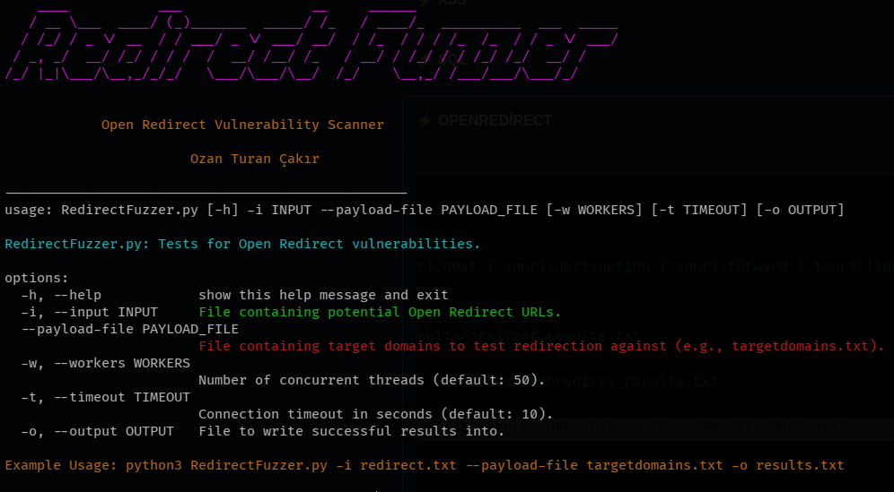

# RedirectFuzzer

Open Redirect zafiyetlerini test eden Python aracıdır.

**Yazar:** Ozan Turan Çakır

⚠️ Bu aracı yalnızca izinli testlerde kullan.

## Kullanım
python3 RedirectFuzzer.py -i urls.txt --payload-file targetdomains.txt -o results.csv

## Gereksinimler
- Python 3.8+
- requests, termcolor, pyfiglet

## 💻 Kullanım (Usage)

Aracın çalıştırılması ve parametreleri aşağıdadır:

