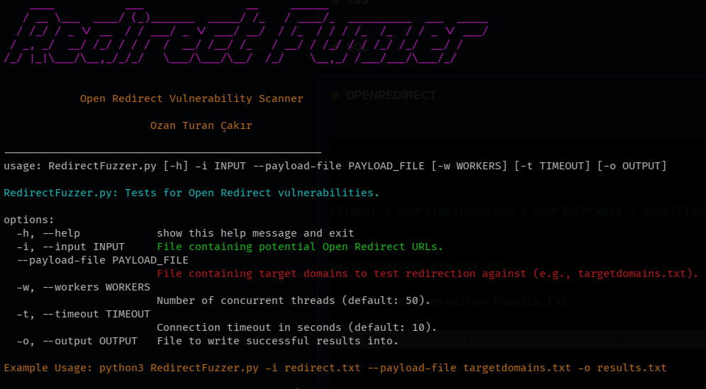

# 🛡️ Redirect Fuzzer
An intelligent Open Redirect vulnerability scanner for security researchers.

**Author:** Ozan Turan Çakır



---

## 🚀 Overview:
**Redirect Fuzzer** is a robust security tool designed to detect Open Redirect vulnerabilities across multiple URLs. By fuzzing all query parameters with various payloads, it helps security researchers quickly identify potential redirect risks.

### 🔑 Features:
* Tests each parameter with single and double URL-encoded payloads.
* Detects successful redirects where the final URL starts with the injected payload.
* Outputs successful vulnerabilities immediately to console and optionally to a file.
* Supports multi-threaded scanning for faster results.

---

## 🛠️ Installation:
1. `git clone https://github.com/ozanturancakir/RedirectFuzzer.git`
2. `cd RedirectFuzzer`
3. `pip3 install -r requirements.txt`

---

## ⚙️ Usage:
```bash
python3 RedirectFuzzer.py -i targets.txt --payload-file redirect_payloads.txt
python3 RedirectFuzzer.py -i targets.txt --payload-file redirect_payloads.txt -w 20 -o results.txt
